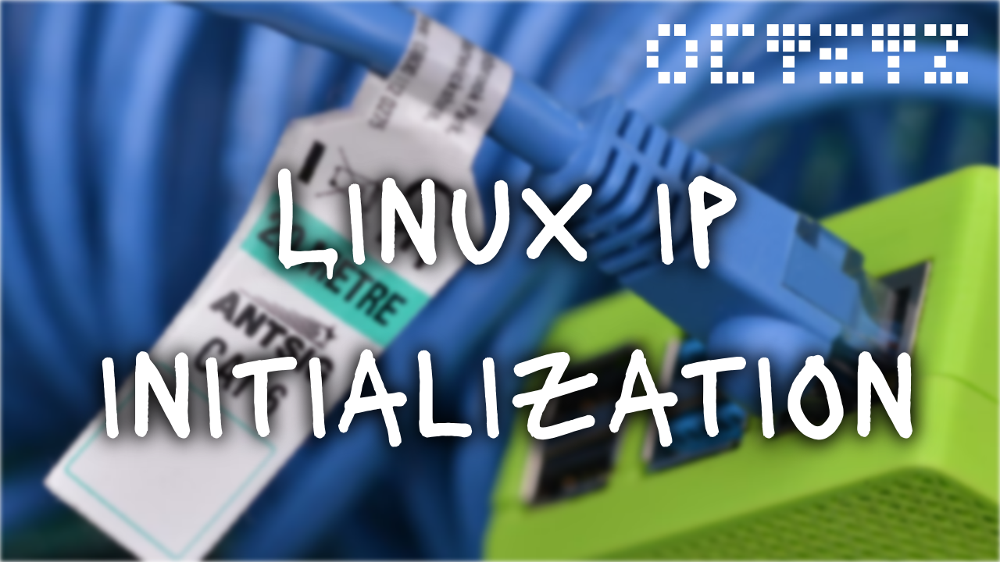
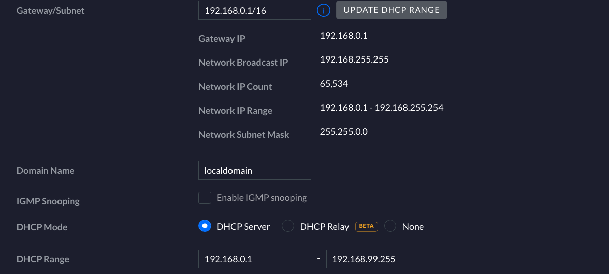
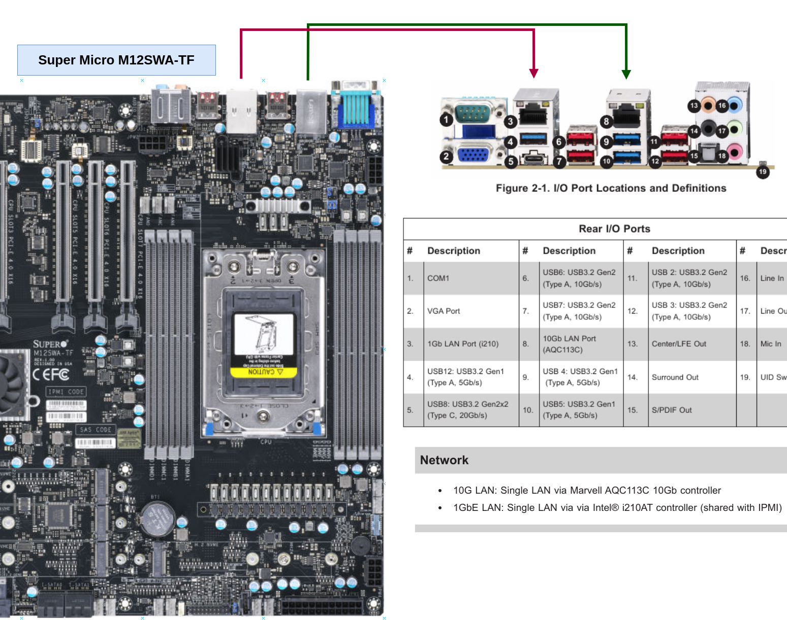

# Linux IP Initialization

IP networking can be an implementation detail largely taken for granted. Thanks
to networking daemons such as
[NetworkManager](https://wiki.archlinux.org/title/NetworkManager) and
[systemd-networkd](https://wiki.archlinux.org/title/systemd-networkd),
assignment of IPs and associated routing is often handled. While convenient, it
may peak curiosity to understand some key questions. What exactly happens behind the scenes? How are our
physical adapters represented in software? And how can discoverability and
routability happen without these utilities? In this post, I'll aim to answer
those questions and learn a bunch more about the Linux networking stack.

<!-- TODO: youtube link -->


## Disabling Network Daemons

In this post, we'll be  manually assigning IP addresses, routes, and more. To
ensure a daemon doesn't attempt to jump in front of you and assign these things,
we should ensure they are disabled on the host. There are several options that
could be controlling a hosts network, but he most common in moderns Linux are
NetworkManager (desktop) and systemd-networkd (server). They can be disabled as
follows.

**NetworkManager**

```
sudo systemctl disable NetworkManager
```

**systemd-networkd**

```
sudo systemctl disable systemd-networkd
```

To ensure there are no left-over network settings from running daemons, restart
the host you are working on. Note that the host will come back **without an IP
assigned**, so you'll need to be able to access it through a method other than
SSH or other network-protocols.

## Enabling Static IP Allocations

To initialize IP addresses manually, we'll rely on [static IP
assignments](https://en.wikipedia.org/wiki/IP_address#Static_IP). In most
networks, our hosts consult a [Dynamic Host Configuration
Protocol](https://en.wikipedia.org/wiki/Dynamic_Host_Configuration_Protocol)
(DHCP) server to retrieve an IP lease. Upon acquiring this lease, the host
becomes routable to the [local area
network](https://en.wikipedia.org/wiki/Local_area_network) (LAN) and likely gets
details about how to route into the [wide area
network](https://en.wikipedia.org/wiki/Wide_area_network) (WAN).

To facilitate this manual-static configuration we need to ensure the network
has:

1. A routable IP space large enough for all the devices on the network.
2. A **subset** of the IP space allocated to dynamic addressing.

The space in the range that is not allocated to dynamic address will the static
IP space which hosts can declare without consulting the DHCP server. My network
configuration is as follows.

* Routable IP Space: `192.168.0.1/16`
  * 65536 usable addresses in the range `192.168.0.1`-`192.168.255.254`
* Dynamically Assignable Range: `192.168.0.1-192.168.99.255`
  * Implies a dynamically-assignable range of `192.168.100.1-192.168.255.254`

The above is configured in your router/gateway and will depend on what software
you're using, such as Ubiquiti or pfSense. In my case, I'll configure by
Ubiquiti internet gateway as follows.




## Understanding Physical Device(s)

To start, let's figure out the physical device(s) that are capable of IP
networking. These could be Ethernet PCI devices, USB-Ethernet dongles, or
wireless cards. Using `dmidecode` we can get details about the motherboard.

```
sudo dmidecode -t 2
```

* `dmidecode`: takes DMI (SMBIOS) table and dumps it into human readable format.
* `-t 2` specifies the type number to print, `2` is for the baseboard
  (motherboard).

In my machine, this provides the following.

```
Getting SMBIOS data from sysfs.
SMBIOS 3.3.0 present.

Handle 0x0002, DMI type 2, 15 bytes
Base Board Information
        Manufacturer: Supermicro
        Product Name: M12SWA-TF
        Version: 1.01
        Serial Number: WM214S603680
        Asset Tag: Default string
        Features:
                Board is a hosting board
                Board is removable
                Board is replaceable
        Location In Chassis: Default string
        Chassis Handle: 0x0003
        Type: Motherboard
        Contained Object Handles: 0
```

Using the above, I can go to the Supermicro website to get the manual for my
[M12SWA-TF](https://www.supermicro.com/en/products/motherboard/M12SWA-TF).
Looking at the manual, I can see there are two network controllers available.



Now that we know the above board has 2 controllers, we can translate that to the
Linux host by listing the PCI devices.

```
lscpi | grep -i ethernet
```

This will return the Intel i210AT and Marvell AQWC113C controllers.

```
67:00.0 Ethernet controller: Intel Corporation I210 Gigabit Network Connection (rev 03)
6a:00.0 Ethernet controller: Aquantia Corp. Device 14c0 (rev 03)
```

* The `I210` is primarily used for remote control via
 [IPMI](https://en.wikipedia.org/wiki/Intelligent_Platform_Management_Interface).
* The `14c0` reports Aquantia Corp instead of Marvell; [they are the same
 company](https://www.marvell.com/company/newsroom/marvell-completes-acquisition-of-aquantia.html).

## Resolving IP Interfaces

With an understanding of our physical hardware, it's time to translate this to
IP interfaces. Using the `ip` tool, we can list known interfaces.

```
ip address
```

The resulting list will display interfaces representing physical and virtual
devices.

```
1: lo: <LOOPBACK,UP,LOWER_UP> mtu 65536 qdisc noqueue state UNKNOWN group
default qlen 1000
    link/loopback 00:00:00:00:00:00 brd 00:00:00:00:00:00
    inet 127.0.0.1/8 scope host lo
       valid_lft forever preferred_lft forever
    inet6 ::1/128 scope host
       valid_lft forever preferred_lft forever
2: enp35s0f3u2u2c2: <BROADCAST,MULTICAST> mtu 1500 qdisc noop state DOWN group
default qlen 1000
    link/ether b0:3a:f2:b6:05:9f brd ff:ff:ff:ff:ff:ff
3: enp103s0: <BROADCAST,MULTICAST> mtu 1500 qdisc noop state DOWN group default
qlen 1000
    link/ether 3c:ec:ef:77:a0:4c brd ff:ff:ff:ff:ff:ff
4: enp106s0: <BROADCAST,MULTICAST> mtu 1500 qdisc noop state DOWN group default
qlen 1000
    link/ether 3c:ec:ef:77:a2:34 brd ff:ff:ff:ff:ff:ff
```

`enp106s0` and `enp103s0` represent the 2 network controllers. How can we
determine which PCI controller they correlate to? A cool trick[^1] to see the
mapping via sysfs is run:

```
grep PCI_SLOT_NAME /sys/class/net/*/device/uevent
```

This will output the PCI address for each interface.

```
/sys/class/net/enp103s0/device/uevent:PCI_SLOT_NAME=0000:67:00.0
/sys/class/net/enp106s0/device/uevent:PCI_SLOT_NAME=0000:6a:00.0
```

Mapping the above to the output of `lspci | grep -i ethernet`, we draw the
following relationships.

* `Intel I210` -> `enp103s0`
* `Aquantia 14c0` -> `enp106s0`

While these examples have been on-board PCI controllers, we should be able to
repeat this process of USB-based Ethernet and wireless devices. Once plugged in to
the host, the interface will automatically be created using a consistent naming
scheme[^2].

## Assigning IP Addresses

The modern tool for interacting with interfaces is `ip`. It does the main
tasks such as adding an IP address, changing the state, and configuring
routing for our interfaces. For this example, I'm going to focus on the 10Gbit
interface `enp106s0`. Its default state is:

```
3: enp106s0: <BROADCAST,MULTICAST> mtu 1500 qdisc mq state DOWN group default qlen 1000
    link/ether 3c:ec:ef:77:a2:34 brd ff:ff:ff:ff:ff:ff
```

First we'll assign the IP address `192.168.105.1` to the interface.

```
sudo ip address add 192.168.105.1/16 dev enp106s0
```

* `192.168.105.1/16`: The IP address is `192.168.105.1` and the `/16` represents
  a netmask of `0.0.255.255`, which correlates to our routable range.
* `dev enp106s0` adds the address exclusively to this interface.

Next, we'll bring the interface UP. This enables it to send packets and respond
to requests, such as an ARP request on the network asking for the existence of
`192.168.105.1`.

```
sudo ip link set enp106s0 up
```

From a **different host** on the network, we can use `arping` to determine
whether the newly set IP is accessible.

```
sudo arping 192.168.105.1
```

Assuming the network is configured properly, this should resolve:

```
ARPING 192.168.105.1 from 192.168.1.132 wlp4s0
Unicast reply from 192.168.105.1 [3C:EC:EF:77:A2:34]  4.363ms
Unicast reply from 192.168.105.1 [3C:EC:EF:77:A0:4C]  4.395ms
Unicast reply from 192.168.105.1 [3C:EC:EF:77:A0:4C]  5.430ms
Unicast reply from 192.168.105.1 [3C:EC:EF:77:A0:4C]  3.942ms
Sent 3 probes (1 broadcast(s))
Received 4 response(s)
```

You'll notice the mac address resolves to `3C:EC:EF:77:A0:4C`, which is the
mac address (correlated to the hardware) `enp106s0` interface. Similarly, if you
`ping` the address from the **other** host, you'll see the entry stored in the
ARP tables.

```
$ arp
Address                  HWtype  HWaddress           Flags Mask            Iface
_gateway                 ether   b4:fb:e4:2d:7f:83   C                     wlp4s0
tugboat.localdomain      ether   3c:ec:ef:77:a0:4c   C                     wlp4s0
192.168.105.1            ether   3c:ec:ef:77:a2:34   C                     wlp4s0
```

Now that the host understands the correlated MAC address, it can send the
Ethernet frame across the network, which the switch understands the port that
`3c:ec:ef:77:a2:34` is plugged into. With the above in place, the state of the
interface is:

```
3: enp106s0: <BROADCAST,MULTICAST,UP,LOWER_UP> mtu 1500 qdisc mq state UP group default qlen 1000
    link/ether 3c:ec:ef:77:a2:34 brd ff:ff:ff:ff:ff:ff
    inet 192.168.105.1/16 scope global enp106s0
       valid_lft forever preferred_lft forever
    inet6 fe80::3eec:efff:fe77:a234/64 scope link
       valid_lft forever preferred_lft forever
```

## Configuring External Routes

While routing across the LAN is possible, the host is unable to route outside
the LAN. For example, a request to `octetz.com` would result in:

```
curl -v octetz.com --interface enp106s0

*   Trying 34.215.133.144:80...
* Immediate connect fail for 34.215.133.144: Network is unreachable
* Closing connection 0
curl: (7) Couldn't connect to server
```

To gain external routability, we need to set the default route to the IP address
of the network's router or gateway. This way, it knows to send packets outside
of 192.168.0.0/16 to the device connected to the wide area network. In many
networks, this IP is the first usable address in the network's range. In my
network of `192.168.0.0/16`, the gateway's address would be `192.168.0.1`. The
default route can now be added:

```
sudo ip route add default via 192.168.0.1 dev enp106s0
```

Now, both internal (LAN) and external (WAN) requests resolve. Re-doing the
`curl` request, we can see a valid response:

```
curl -v octetz.com --interface enp106s0

*   Trying 34.215.133.144:80...
* Connected to octetz.com (34.215.133.144) port 80 (#0)
> GET / HTTP/1.1
> Host: octetz.com
> User-Agent: curl/7.80.0
> Accept: */*
>
* Mark bundle as not supporting multiuse
< HTTP/1.1 301 Moved Permanently
< Server: nginx/1.14.0 (Ubuntu)
< Date: Fri, 24 Dec 2021 18:27:41 GMT
< Content-Type: text/html
< Content-Length: 194
< Connection: keep-alive
< Location: https://octetz.com/
<
<html>
<head><title>301 Moved Permanently</title></head>
<body bgcolor="white">
<center><h1>301 Moved Permanently</h1></center>
<hr><center>nginx/1.14.0 (Ubuntu)</center>
</body>
</html>
* Connection #0 to host octetz.com left intact
```

To see the host's routing configuration, you can run:

```
ip route
```

On my host, I can see the following routes:

```
default via 192.168.0.1 dev enp106s0
192.168.0.0/16 dev enp106s0 proto kernel scope link src 192.168.105.1
```

## Automating IP Assignments

While good for learning purposes, it's unlikely you'll go through the above
every time you reboot your host. However, what if we could take our static IP
addressing above and apply it in a minimal manner? This is possible using
`systemd-networkd`. This is **not** your only choice for automation. The reason
I'm selecting `systemd-networkd` because:

* In my distribution, it is pre-installed.
* It is portable to any Linux distribution using systemd, which
  is most of them.
  * I prefer it over [netplan](https://netplan.io), because I find netplan's
    abstraction unecessary and netplan tends to be preferred for Ubuntu. 
* While [NetworkManager](https://wiki.archlinux.org/title/NetworkManager) is
  great, I typically find its conveniences unnecessary unless I'm dealing with
wireless cards.
* I'm on a wired connection, which is particularly easy with `systemd-networkd`.
  * Wireless connections are entirely possibly, just more complicated[^3].

A summary of all the configuration done to our host is:

* Assign `192.168.105.1` to `enp106s0`.
* Set a default route of `192.168.0.1` for `enp106s0`.
* Use `1.1.1.1`, a potentially safer/faster DNS resolver[^4].

To do this, I'll save the following in `/etc/systemd/network/10-wired.network`.

```
[Match]
Name=enp106s0

[Network]
Address=192.168.105.1/16
Gateway=192.168.0.1
DNS=1.1.1.1
```

Now you can enable the `systemd-networkd` unit to start when the host boots.

```
sudo systemctl enable systemd-networkd
```

Lastly, via either deleting all the setting created with the `ip` tool or
through a reboot, you can see the link get brought up:

```
journalctl -f -u systemd-networkd
```

With this, we'll see the link come up:

```
Dec 24 17:32:10 tugboat systemd-networkd[10973]: enp106s0: Link UP
Dec 24 17:32:10 tugboat systemd-networkd[10973]: enp106s0: Gained carrier
Dec 24 17:32:10 tugboat systemd-networkd[10973]: lo: Link UP
Dec 24 17:32:10 tugboat systemd-networkd[10973]: lo: Gained carrier
Dec 24 17:32:10 tugboat systemd-networkd[10973]: enp106s0: Gained IPv6LL
Dec 24 17:32:10 tugboat systemd-networkd[10973]: Enumeration completed
Dec 24 17:32:10 tugboat systemd[1]: Started Network Configuration.
```

For further validation, the `ip` commands executed throughout this post can used
to validate the IP assignment and routing rules.

## References and Attribution

[^1]: [Cool trick on PCI slot mapping from Vladimir Panteleev on
  StackExchange](https://askubuntu.com/a/985725)
[^2]: [Consistent Network Device
  Naming](https://en.wikipedia.org/wiki/Consistent_Network_Device_Naming)
[^3]: [DNS Resolution via Cloudflare's 1.1.1.1](https://1.1.1.1/dns) such as
  your internet service provider (ISP).
[^4]: [Arch Wiki: systemd-networkd wireless adapter
  example](https://1.1.1.1/dn://wiki.archlinux.org/title/systemd-networkd#Wireless_adapter)
such as your internet service provider (ISP).
* [Title card photo by Gavin Allanwood via
  Unsplash](https://unsplash.com/photos/IPApn5olGLk)
